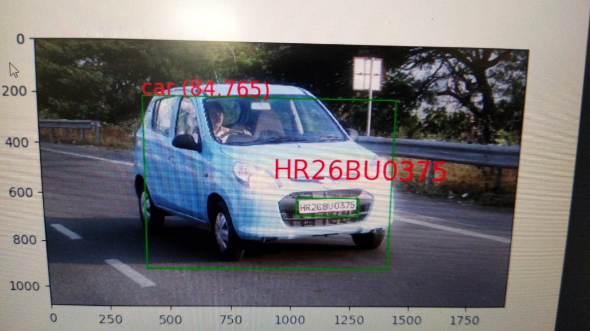
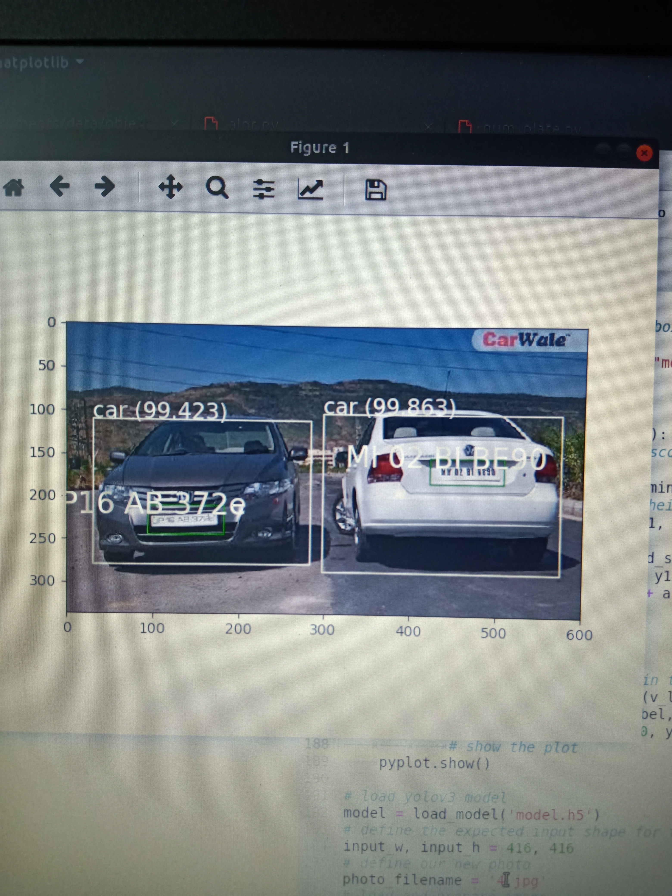

# Vehicle Number Plate Detection
In this project - 
1. Vehicle is detected by YOLO object detection algorithm
2. Number plate of vehicle is cropped from detected vehicle.
3. Text is extracted from number plate via Google Vision api.

  

  

  

